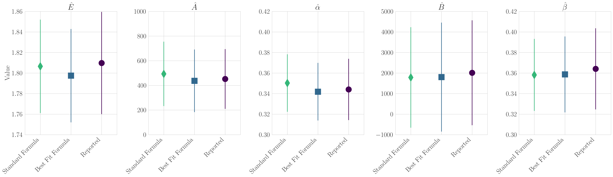

# Chinchilla Compute-Optimal Scaling of Language Models Is Surprisingly Robust


[**Installing**](#installing) | [**Running**](#running) | [**Contributing**](#contributingvlm) | [**Citing**](#citing) | [**Contacting**](#contacting)


## Installing

1. (Optional) Update conda:

`conda update -n base -c defaults conda -y`

2. Create and activate the conda environment:

`conda create -n chinchilla_env python=3.11 -y && conda activate chinchilla_env`

3. Install the required packages:

`pip install autograd matplotlib pandas scipy seaborn`


## Running

[00_correcting_parameters.py](notebooks/00_assessing_parameters/00_correcting_parameters.py) produces the relative error of reported parameters vs the "correct" equation and vs the "incorrect" equation:


[01_epoch_research_fitting.py](notebooks/01_epoch_research_fitting/01_epoch_research_fitting.py) produces the compute-optimal tokens-per-parameter and the estimated neural scaling law parameters:




[02_robustness_analysis.py](notebooks/02_robustness_analysis/02_robustness_analysis.py) produces 

Note: Our [Chinchilla fitting code](src/epoch_research_chinchilla_fit.py) was adapted from Epoch AI's [Chinchilla Scaling: A Replication Attempt](https://github.com/epoch-research/analyzing-chinchilla/).
We appreciate the authors for open-sourcing their fitting code and for answering our questions. 


## Contributing

Contributions are welcome! Please format your code with [black](https://github.com/psf/black) before submitting PRs.

## Citing

To cite this work, please use:

```bibtex
```

## Contacting

Questions? Comments? Interested in collaborating?
Open an issue or email rschaef@cs.stanford.edu and/or any of the other authors.